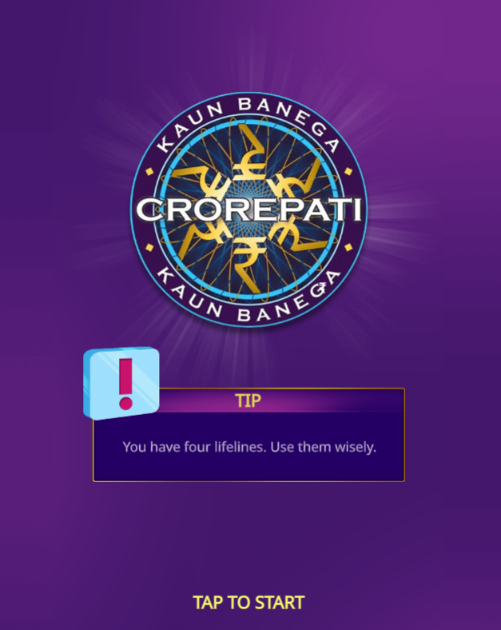
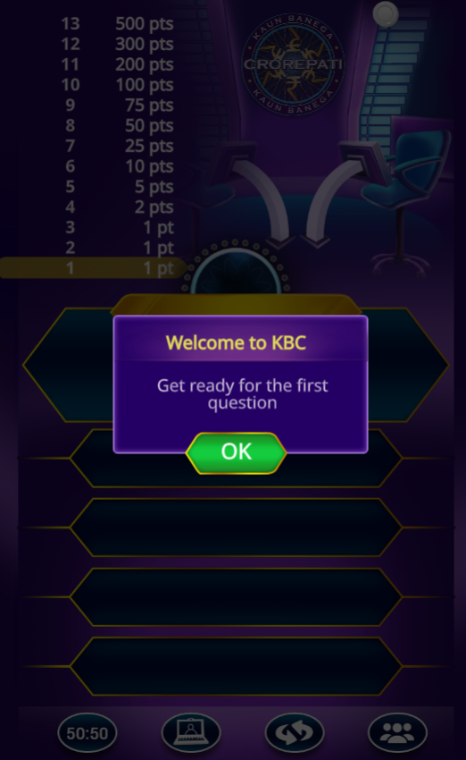
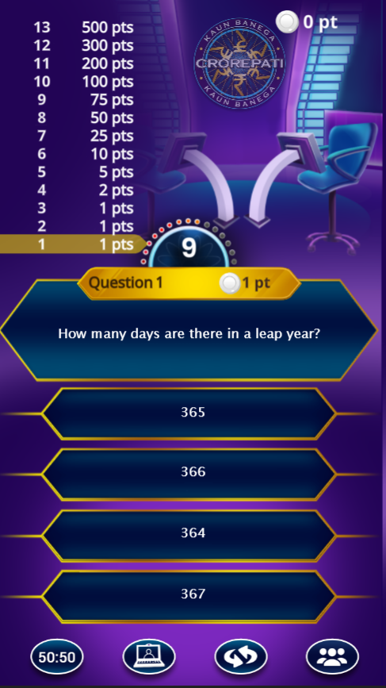
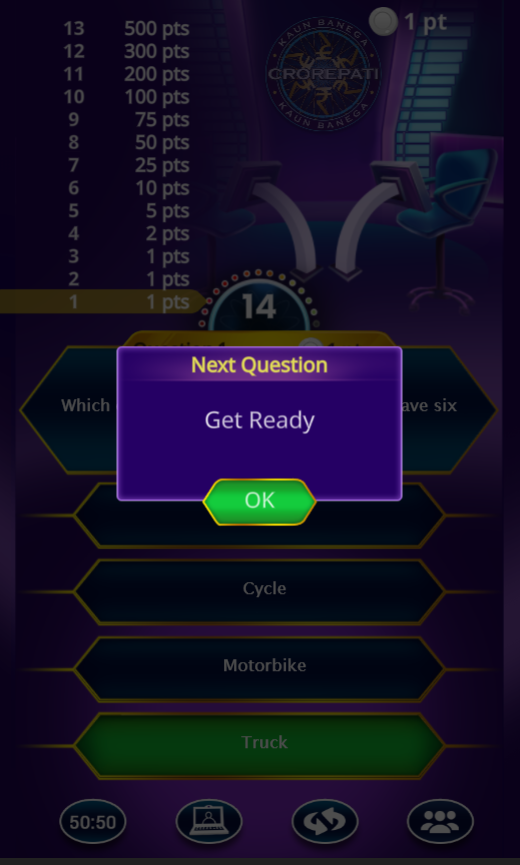
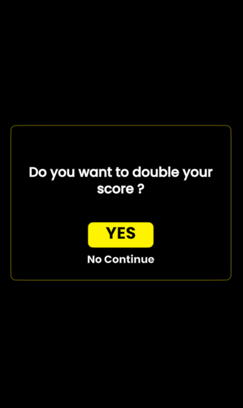
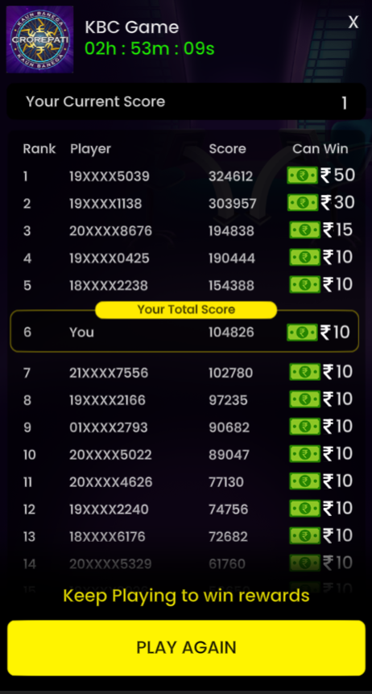

# Kaun Banega Crorepati Auto Game Play in Sony Liv app
This Python Script automates the Kaun Banega Crorepati Game Play in Sony Liv Platform as shown below

https://user-images.githubusercontent.com/36266203/150627537-b3bf89a2-d5fc-4c05-b81e-b6fc9d83df31.mp4

### Brief Introduction to Kaun Banega Crorepati Game
* Each Game has total of 13 Questions with 15 seconds timelimit to answer each question
* Each Question as four Options and the order of these options are fixed
* There are four life lines to use if the answer is unsure, of which, below are the two life lines that gives the answer directly

  * Expert Advice
  * Audiance Poll
 
### Game Screenshots
* Launch Screen
  
  
* Jump Start Screen. if clicked on "YES", Ad will be played.

   
* First Question Start Screen

   
* Question Screen

   
* Next Question Start Screen

   
* Double Score Screen. Once the 13 questions are answered or Game over, clicking on double your score will double the score by playing Ad

   
* Game Ranking Screen

   

### Python Libraries
* PyautoGUI -- lets your Python scripts control the mouse and keyboard to automate interactions with other applications.
* mss -- lets you take the screenshots of the screen
* pickle -- lets you save python objects to a file and retrieve from a file
* pytesseract -- optical character recognition (OCR) tool
* Numpy and OpenCV -- lets you process the screenshots captured

### Automation Steps
1. Capture the Question screenshot from the Question Screen using mss
2. Extract the question from screenshot uisng the pytesseract
3. Check whether the question exists in the python dictionary
4. if the question exists, get the option number from the dictionary and click on the option using PyautoGUI and proceed to next question
5. if the question does not exist, use the "Expert Advice" life line and get the answer and save it in the dictionary and click on the option using PyautoGUI and proceed to next question
6. if the question does not exist and we already used the "Expert Advice" life line, get the answer using the "Audience Poll" life line and save the answer. Click on the option different from the answer to come out of the Game.
7. Restart the Game and go to step 1
